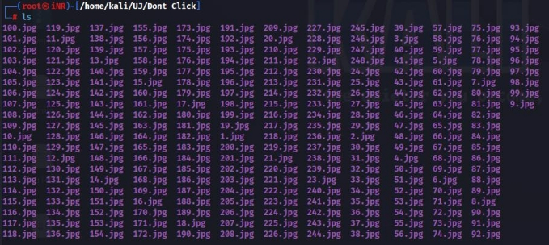
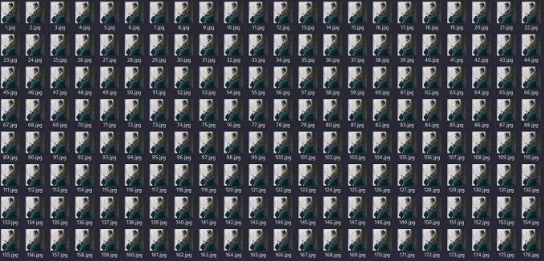

**Invisible Description**

#Steganography!


[Dont_Click.zip](http://139.59.212.68/files/d54cd94125227bdabb639718ea2e7b7d/Dont_Click.zip?token=eyJ1c2VyX2lkIjoxMTQsInRlYW1faWQiOjUsImZpbGVfaWQiOjd9.ZUf6SA.6s15T-9bz0Rh4qAjvyhQJLlvWWU)

First we unzip the file.

unzip Dont\_Click.zip

The file contains 248 JPEG pictures



Since there is 248 pictures we need to differentiation them in some way.

first I tried to differentiation them by opening the pictures but they looked fairly similar.



So I needed to find another way.

**Foothold**

ls -al


I found that some pictures have different size / length , so I made another directory and moved all the different sized pictures to that directory.


There was 6 pictures with different size.

I tried strings | grep "UJCYC" since flag start with UJCYC but that did not get me anywhere.

then I tried steghide info 1.jpg


and we can see that there is embedded data indeed.

I used stegseek 1.jpg /usr/share/wordlists/rockyou.txt to brute force the passphrase

with rockyou.txt wordlist since I don't know the passphrase and we found the passphrase.


cat 1.jpg.out


we found a flag but its a fake one. i tried the same method to for all 6 pictures and I found the real flag in 189.jpg


```
FLAG : UJCYC{N0T\_1NV1S1BL3\_3N0UGH}
```
